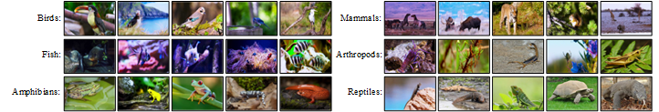

# WATS-DA
## Wildlife2024 Dataset

### Download
The training set for the dataset Wildlife2024 is available for download on [Drive](https://pan.quark.cn/s/f9aec26b21a5),code：4whM, and the test set is [WATB](https://w-1995.github.io/EvaluationandResult.html).
## Trackers

| Trackers | Description | Language | Trackers | Description | Language |
| :---------- | :-----------: | :---------: | :---------- | :-----------: | :---------: |
| SMAT | WACV2024 | Python | CNNInMo| IJCAI2022 | Python |
| SGDViT| ICRA2023 | Python | Stark | ICCV2021 | Python |
| TCTrack++| TPAMI2023 | Python | MVT | BMVC2023 | Python |
| ETTrack | WACV2023 | Python | SiamGAT | CVPR2021 | Python |
| CTTrack | AAAI2023 | Python | HiFT| ICCV2021 | Python |
| SiamTPN | WACV2022 | Python | SiamCAR | CVPR2020 | Python |
| SiamRBO | CVPR2022 | Python | SiamBAN | CVPR2020 | Python |

## evaluation
### WATB

| Trackers | Precision | Normalized Precision | Success | Trackers | Precision | Normalized Precision | Success |
| :---------- | :-----------: | :-----------: | :-----------: | :---------- | :-----------: | :-----------: | :-----------: |
| SMAT | 0.554 | 0.554 | 0.489 | CNNInMo | 0.523 | 0.514 | 0.455 |
| SGDViT | 0.474 | 0.475 | 0.419 | Stark-Got | 0.520 | 0.515 | 0.467 |
| TCTrack++ | 0.501 | 0.495 | 0.432 | MVT | 0.535| 0.538 | 0.471 |
| ETTrack | 0.505 | 0.512 | 0.454 | SiamGAT | 0.511 | 0.515 | 0.442 |
| CTTrack | 0.551 | 0.544 | 0.491 | HiFT | 0.480 | 0.477 | 0.414 |
| SiamTPN | 0.471 | 0.481 | 0.425 | SiamCAR | 0.479 | 0.476 | 0.415 |
| SiamRBO | 0.510 | 0.498 | 0.443 | SiamBAN | 0.527 | 0.518 | 0.439 |
| WATS-DA(CAR) | 0.564 | 0.553 | 0.493 |WATS-DA(RBO) |	0.565 |	0.549 |	0.502 |

### Wildlife2024-test

## test

Download pre-trained models for [ar](https://drive.google.com/drive/folders/1_dPapMvHy1iewJ2MmyWXj3BB-aIlHNLA?usp=sharing) and [re-detection](https://drive.google.com/drive/folders/1yIeq0CCi-JFDECafOA9fPkZSa_v9ILPL?usp=sharing) before testing.Pre-trained models for testing are acquired：

| Trackers | model | 
| :---------- | :-----------: | 
| WATS-DA(CAR) | [car](https://drive.google.com/file/d/17ZX_PwSKtrQGjlVsRaw-VXacc4XIe4yd/view?usp=sharing) | 
| WATS-DA(GAT) | [gat](https://drive.google.com/file/d/1ug3VJCSOH0yf6Rc38A-GdPXWU-9FcQoL/view?usp=sharing) | 
| WATS-DA(RBO) | [rbo](https://drive.google.com/file/d/1i_eoOnHCUb6AF6K76PDd2UuygjUYQ0mp/view?usp=sharing) |
| WATS-DA(BAN) | [ban](https://drive.google.com/file/d/1XNugJ2i0Wqi_31wmXjy8H_5wfsrb5_lA/view?usp=sharing) |

## train

Please download the pre-training model for each baseline tracker prior to training.

| Trackers | model | 
| :---------- | :-----------: | 
| siamcar | [herf](https://drive.google.com/file/d/15GXHlNz1OzRnIT4mFyziEvquf3cUVppQ/view?usp=sharing) | 
| siamgat | [herf](https://drive.google.com/file/d/1a7P3BlCwFUFIdtcs-1MOXUF5gRuSzt3T/view?usp=sharing) | 
| siamrbo | [herf](https://drive.google.com/file/d/1OdBbVLmbRCef3uq9D40JfDy99uAWB3XW/view?usp=sharing) |
| siamban | [herf](https://drive.google.com/file/d/1ScO4INZDF2iwolsz-eAslI3h4wmhkbuv/view?usp=sharing) |
