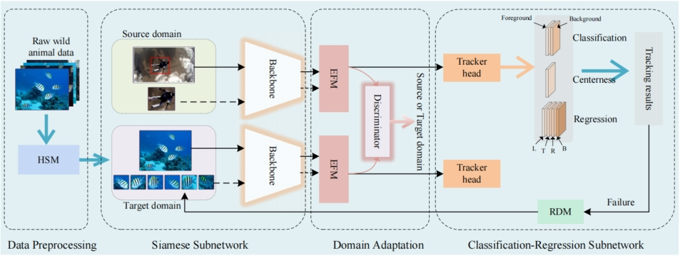

# Wild Animal Tracking with High-Quality Segment Anything Model and Domain Adaptation
Ganggang Huang, Fasheng Wang*, Binbin Wang, Hanwei Li, Mingshu Zhang, Mengyin Wang, Fuming Sun and Haojie Li

  *Corresponding author.

## ✉️ News
* [2024.04.30] The Paper of WATS-DA was Accepted by CVPR 2024 Workshop ([paper](https://drive.google.com/file/d/1LDLmI9Xs2CkaOezgWVm3gNnUr21n2smR/view)).
## :star:Framework


## :star2:Visualization of HSM


## :hammer:Installation
This code has been tested on Ubuntu 22.04, Python 3.10.13, Pytorch 2.0.0, and CUDA 12.2 Please install related libraries before running this code:

Install HQ-SAM:

```
cd hqsam
pip install -e .
```

Install WATS-DA:

```
pip install -r requirements.txt
```
## :wrench:Test WATS-DA
* Download pre-trained models for [ar](https://drive.google.com/drive/folders/1_dPapMvHy1iewJ2MmyWXj3BB-aIlHNLA?usp=sharing) and [re-detection](https://drive.google.com/drive/folders/1yIeq0CCi-JFDECafOA9fPkZSa_v9ILPL?usp=sharing) before testing.Pre-trained models for testing are acquired：

* Download a model checkpoint below and put it in

`./snapshot_WATS-DA/`
| Trackers | model | 
| :---------- | :-----------: | 
| WATS-DA(CAR) | [car](https://drive.google.com/file/d/17ZX_PwSKtrQGjlVsRaw-VXacc4XIe4yd/view?usp=sharing) |
| WATS-DA(RBO) | [rbo](https://drive.google.com/file/d/1i_eoOnHCUb6AF6K76PDd2UuygjUYQ0mp/view?usp=sharing) | 

* Download [WATB](https://w-1995.github.io/EvaluationandResult.html) dataset and put it in `./test_dataset/WATB`.

* Download [Wildlife2024-test](https://pan.quark.cn/s/4bffd8e60b77) dataset and put it in `./test_dataset/Wildlife2024-test`.

* Test and evalute:

```
cd ./tools
python test.py --dataset WATB --snapshot ./snapshot_WATS-DA/model.pth
```
## :mag_right:Train WATS-DA
* The automatic annotation generation module for target domain training samples based on HQ-SAM performs sample annotation generation on Wildlife2024-train:

1. Download the [Wildlife2024-train](https://pan.quark.cn/s/6e57db50f112) dataset and put it in `./train_dataset/Wildlife2024-train`.

2. Automatic sample annotation generation:
```
python label_hqsam.py  # Acquire the json file 
python list.py  # Merge the json file
python crop.py # crop the patches
```
* Prepare the source domain dataset TrackingNet:
1. Download the [TrackingNet](https://github.com/SilvioGiancola/TrackingNet-devkit) dataset and put it in `./train_dataset/TrackingNet`.
2. Crop the TrackingNet data:
```
python crop.py 511 12
python gen_json.py
```
* Please download the pre-training model for each baseline tracker prior to training and put it in `./pretrain_model/`:

| Trackers | model | 
| :---------- | :-----------: | 
| siamcar | [herf](https://drive.google.com/file/d/15GXHlNz1OzRnIT4mFyziEvquf3cUVppQ/view?usp=sharing) | 
| siamrbo | [herf](https://drive.google.com/file/d/1OdBbVLmbRCef3uq9D40JfDy99uAWB3XW/view?usp=sharing) |

* Train WATS-DA model:

```
python ./tool/train.py --model WATS-DA
```
## :smile:evaluation
* Run eval.py
```
python ./tools/eval.py
```
### WATB

| Trackers | Precision | Normalized Precision | Success | Trackers | Precision | Normalized Precision | Success |
| :---------- | :-----------: | :-----------: | :-----------: | :---------- | :-----------: | :-----------: | :-----------: |
| SMAT | 0.554 | 0.554 | 0.489 | CNNInMo | 0.523 | 0.514 | 0.455 |
| SGDViT | 0.474 | 0.475 | 0.419 | Stark-Got | 0.520 | 0.515 | 0.467 |
| TCTrack++ | 0.501 | 0.495 | 0.432 | MVT | 0.535| 0.538 | 0.471 |
| ETTrack | 0.505 | 0.512 | 0.454 | SiamGAT | 0.511 | 0.515 | 0.442 |
| CTTrack | 0.551 | 0.544 | 0.491 | HiFT | 0.480 | 0.477 | 0.414 |
| SiamTPN | 0.471 | 0.481 | 0.425 | SiamBAN | 0.527 | 0.518 | 0.439 |
| SiamCAR | 0.479 | 0.476 | 0.415 | SiamRBO | 0.510 | 0.498 | 0.443 | 
| WATS-DA(CAR) | 0.564 | 0.553 | 0.493 |WATS-DA(RBO) |	0.565 |	0.549 |	0.502 |

### Wildlife2024-test

| Trackers | Precision | Normalized Precision | Success | Trackers | Precision | Normalized Precision | Success |
| :---------- | :-----------: | :-----------: | :-----------: | :---------- | :-----------: | :-----------: | :-----------: |
| SMAT | 0.878 | 0.909 | 0.740 | CNNInMo | 0.801 | 0.841 | 0.680 |
| SGDViT | 0.768 | 0.827 | 0.641 | Stark-Got | 0.840 | 0.874 | 0.718 |
| TCTrack++ | 0.791 | 0.848 | 0.668 | MVT | 0.851| 0.898 | 0.717 |
| ETTrack | 0.820 | 0.876 | 0.703 | SiamGAT | 0.786 | 0.861 | 0.678 |
| CTTrack | 0.872 | 0.890 | 0.741 | HiFT | 0.764 | 0.835 | 0.643 |
| SiamTPN | 0.773 | 0.848 | 0.667 | SiamBAN | 0.836 | 0.881 | 0.698 |
| SiamCAR | 0.783 | 0.835 | 0.669 | SiamRBO | 0.822 | 0.866 | 0.690 |
| WATS-DA(CAR) | 0.845 | 0.876 | 0.738 |WATS-DA(RBO) |	0.857 |	0.889 |	0.750 |
## Dataset

## Wildlife2024 Dataset


### Download
The training set for the dataset Wildlife2024 is available for download on [Drive](https://pan.quark.cn/s/f9aec26b21a5),code：4whM, and the test set is [WATB](https://w-1995.github.io/EvaluationandResult.html).
The test set has also been open source, you can download from the [website](https://pan.quark.cn/s/6e57db50f112) itself,code:Bwq4
## Trackers


| Trackers | Description | Language | Trackers | Description | Language |
| :---------- | :-----------: | :---------: | :---------- | :-----------: | :---------: |
| SMAT | WACV2024 | Python | CNNInMo| IJCAI2022 | Python |
| SGDViT| ICRA2023 | Python | Stark | ICCV2021 | Python |
| TCTrack++| TPAMI2023 | Python | MVT | BMVC2023 | Python |
| ETTrack | WACV2023 | Python | SiamGAT | CVPR2021 | Python |
| CTTrack | AAAI2023 | Python | HiFT| ICCV2021 | Python |
| SiamTPN | WACV2022 | Python | SiamCAR | CVPR2020 | Python |
| SiamRBO | CVPR2022 | Python | SiamBAN | CVPR2020 | Python |

## License
This project is released under the Apache 2.0 license.

## Acknowledgments
We sincerely thank the contribution of following repos:[SAM-DA](https://github.com/vision4robotics/SAM-DA),[SiamRBO](https://github.com/sansanfree/RBO),[SiamCAR](https://github.com/ohhhyeahhh/SiamCAR)和[HQ-SAM](https://github.com/SysCV/SAM-HQ).

## Citation
``` 
@inproceedings{
anonymous2024wild,
title={Wild Animal Tracking with High Quality-{SAM} and Domain Adaptation},
author={Ganggang Huang, Mengyin Wang, Fasheng Wang, Fuming Sun, Haojie Li},
booktitle={4th Workshop on CV4Animals: Computer Vision for Animal Behavior Tracking and Modeling, In conjunction with CVPR 2024},
year={2024},
url={https://openreview.net/forum?id=3LJZexKzis}
}
```

## Contact
If you have any questions, please contact Ganggang Huang at hgg20210315@163.com.
<!-- ## test

Download pre-trained models for [ar](https://drive.google.com/drive/folders/1_dPapMvHy1iewJ2MmyWXj3BB-aIlHNLA?usp=sharing) and [re-detection](https://drive.google.com/drive/folders/1yIeq0CCi-JFDECafOA9fPkZSa_v9ILPL?usp=sharing) before testing.Pre-trained models for testing are acquired：

| Trackers | model | 
| :---------- | :-----------: | 
| WATS-DA(CAR) | [car](https://drive.google.com/file/d/17ZX_PwSKtrQGjlVsRaw-VXacc4XIe4yd/view?usp=sharing) |
| WATS-DA(RBO) | [rbo](https://drive.google.com/file/d/1i_eoOnHCUb6AF6K76PDd2UuygjUYQ0mp/view?usp=sharing) |  -->
<!-- | WATS-DA(GAT) | [gat](https://drive.google.com/file/d/1ug3VJCSOH0yf6Rc38A-GdPXWU-9FcQoL/view?usp=sharing) |  -->

<!-- | WATS-DA(BAN) | [ban](https://drive.google.com/file/d/1XNugJ2i0Wqi_31wmXjy8H_5wfsrb5_lA/view?usp=sharing) | -->

<!-- ## train

Please download the pre-training model for each baseline tracker prior to training.

| Trackers | model | 
| :---------- | :-----------: | 
| siamcar | [herf](https://drive.google.com/file/d/15GXHlNz1OzRnIT4mFyziEvquf3cUVppQ/view?usp=sharing) | 
| siamrbo | [herf](https://drive.google.com/file/d/1OdBbVLmbRCef3uq9D40JfDy99uAWB3XW/view?usp=sharing) | -->
<!-- | siamgat | [herf](https://drive.google.com/file/d/1a7P3BlCwFUFIdtcs-1MOXUF5gRuSzt3T/view?usp=sharing) |  -->

<!-- | siamban | [herf](https://drive.google.com/file/d/1ScO4INZDF2iwolsz-eAslI3h4wmhkbuv/view?usp=sharing) | -->
